# Building a POA_Blockchain 
## Building Blocks
1) Open Terminal and Navigate to Blockchain tools
2) Create folders inside Blockchain Tools
3) Capture screenshots of the different steps

## Node Setup 

1) In terminal navigate yo blockchian tools and make the following folders
* mkdir node1
* mkdir node2

2) We now need to make accounts for both the nodes
* ./geth account datadir node1
* ./geth account datadir node2

3) You will be prompted to make a password, make sure you save it somewhere!!!
* Once you setup the password you will be able to see you public address.

 As you can see the public key for node1 is 0xEdd8E63B522993BF41b7B9b563Ee7309D4B58357,
 for node2 the public key is 0x669Ec1d1aF062f84bddE6B1b02e99E777625a663.
 
4) The next is to create a text file for the passwords and the account number. This will make it easier when starting the blockchain up.

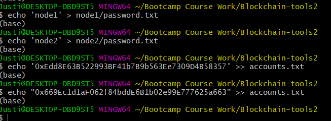

5) Now we can run puppeth and start creating our chain

* We will be have to give the network a name

Name - justin

* Pick a consensus algorithm

algo - POA

* Determine the seconds a block should take

seconds - 15

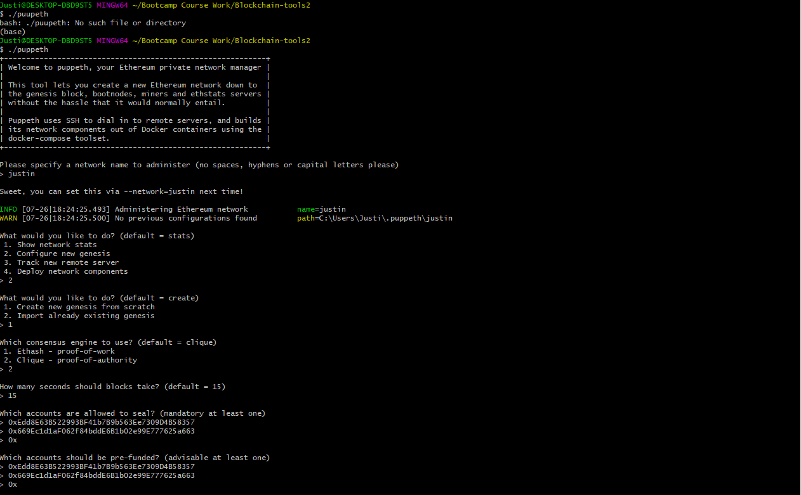

* Set a chainID 

chainID - 777

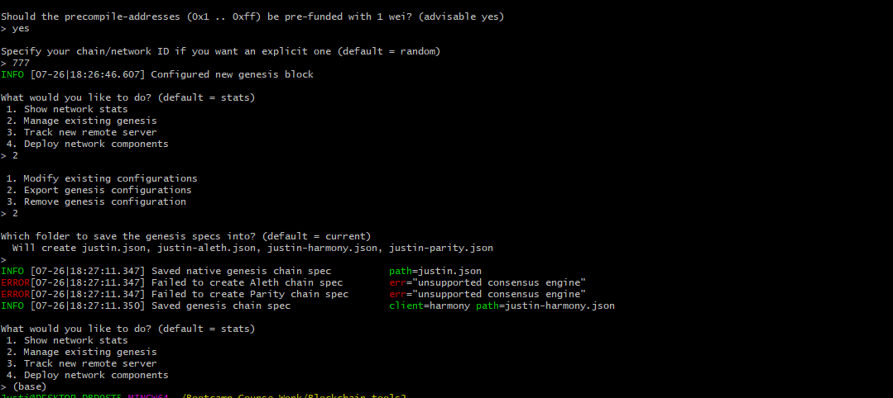

6) Exit the puppeth setting by using control C or ctrl C

7) Now  initalize each node

./geth init justin.json -datadir node1

./geth init justin.json -datadir node2

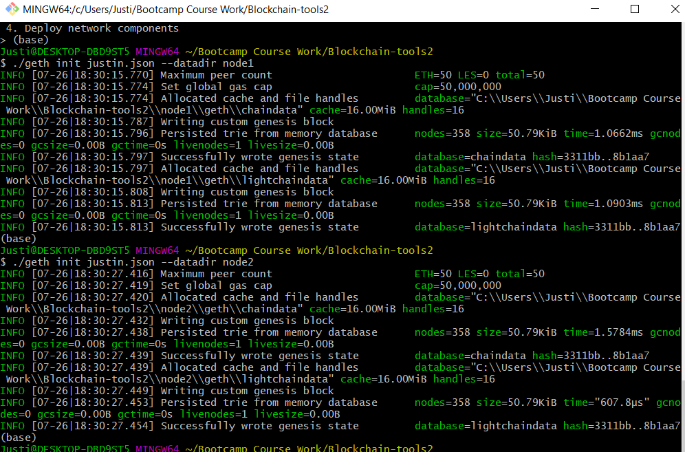

8) Now we need to start mining for both our nodes

./geth --datadir node1/ --mine --miner.threads 1 --unlock '0xEdd8E63B522993BF41b7B9b563Ee7309D4B58357' --password node1/password.txt --rpc --allow-insecure-unlock

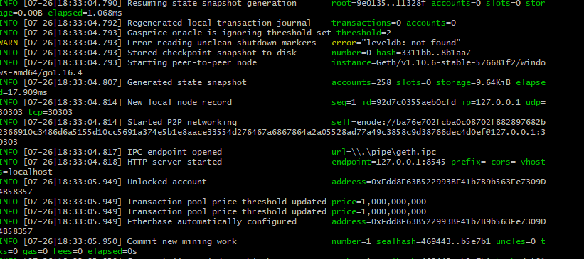

enode = =enode://ba76e702fcba0c08702f882897682b2366910c3486d6a5155d10cc5691a374e5b1e8aace33554d276467a6867864a2a05528ad77a49c3858c9d38766dec4d0ef@127.0.0.1:30303

./geth --datadir node2/ --port 30304 --bootnodes 'enode://ba76e702fcba0c08702f882897682b2366910c3486d6a5155d10cc5691a374e5b1e8aace33554d276467a6867864a2a05528ad77a49c3858c9d38766dec4d0ef@127.0.0.1:30303'

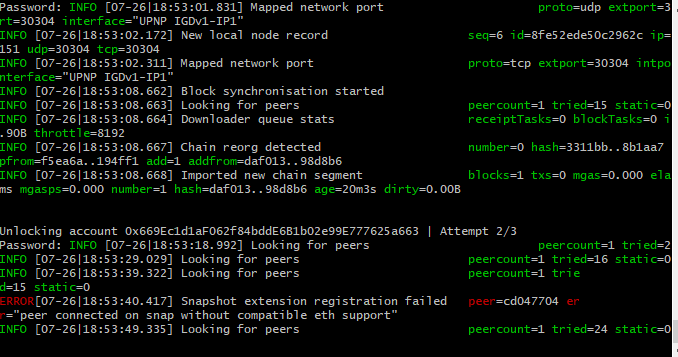

## MyCrypto

1) Click on "Add custom node", you then add your network information.

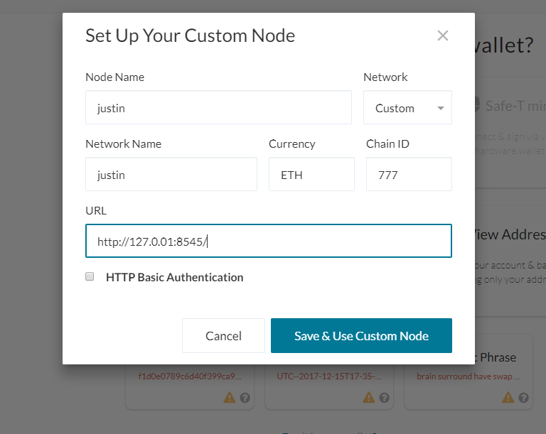

2) You then need to import your keystore file and put in your password to unlock your wallet. 

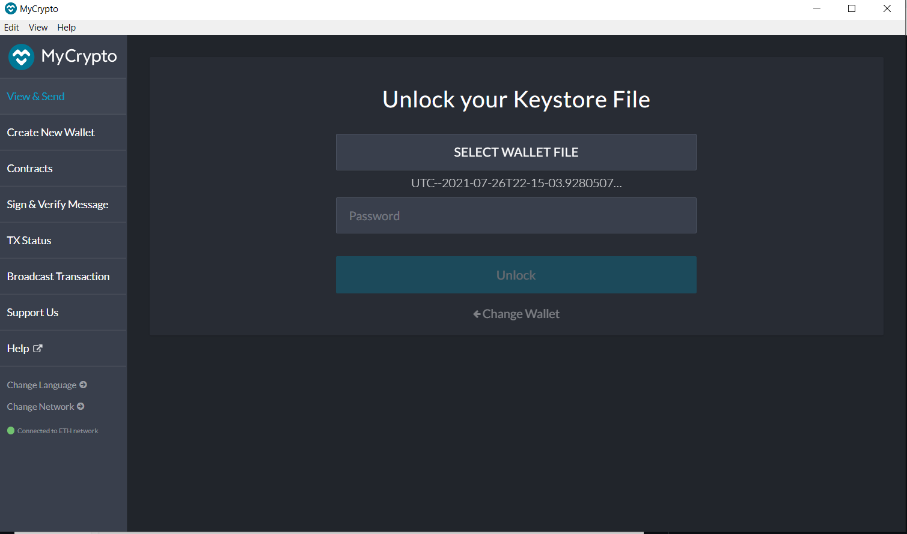

3) Now that it is unlocked we will initiate a transaction

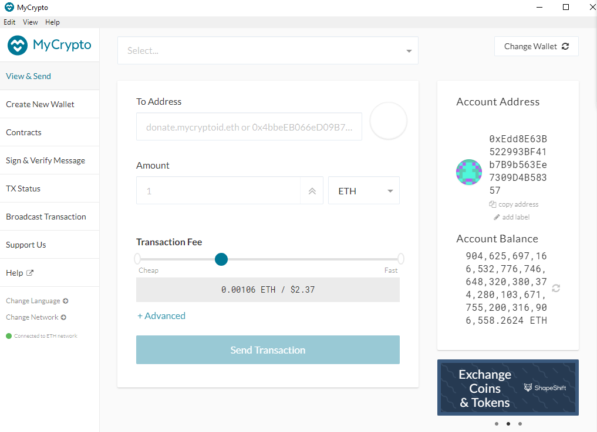
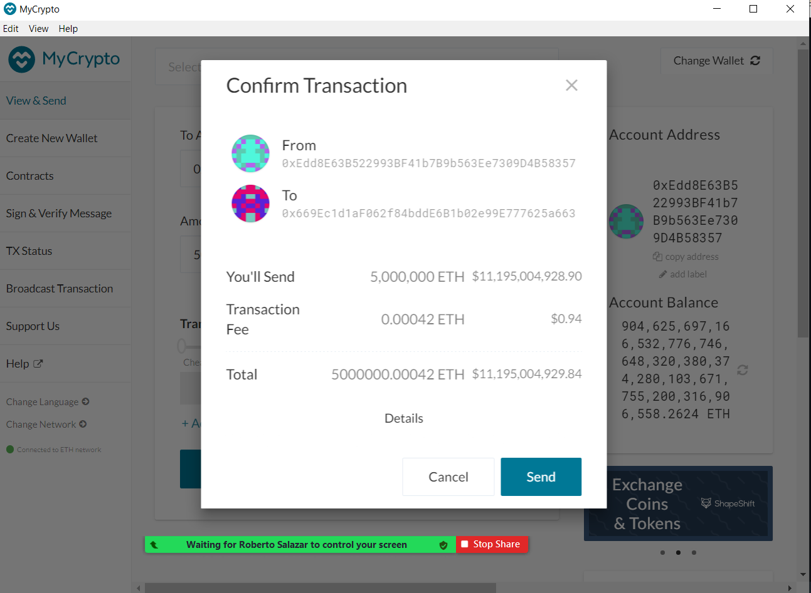
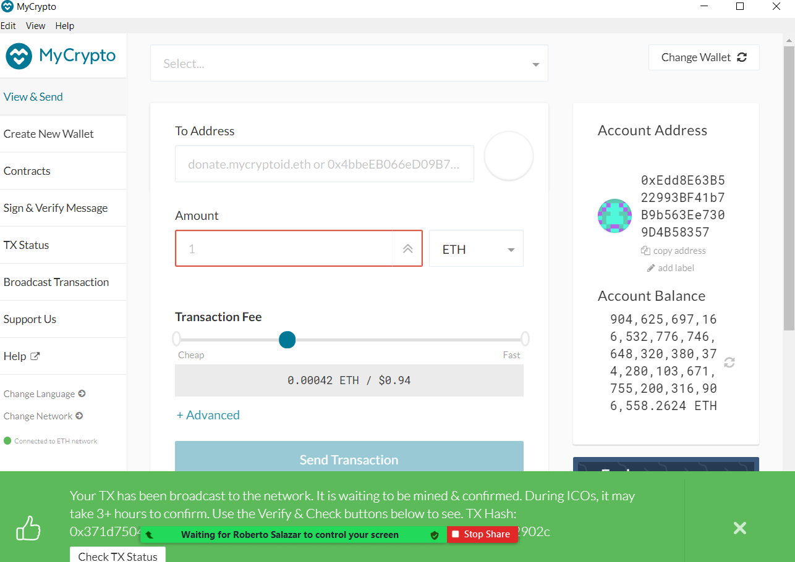

4) Now let's look at the confirmation of this transactions to make sure it was funded

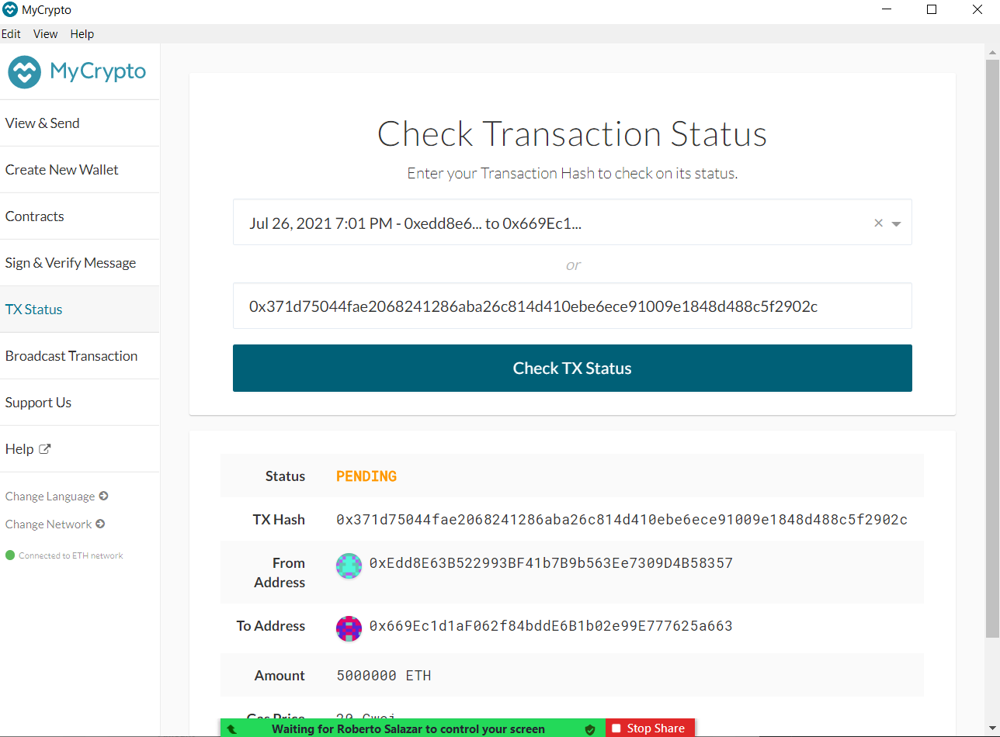

